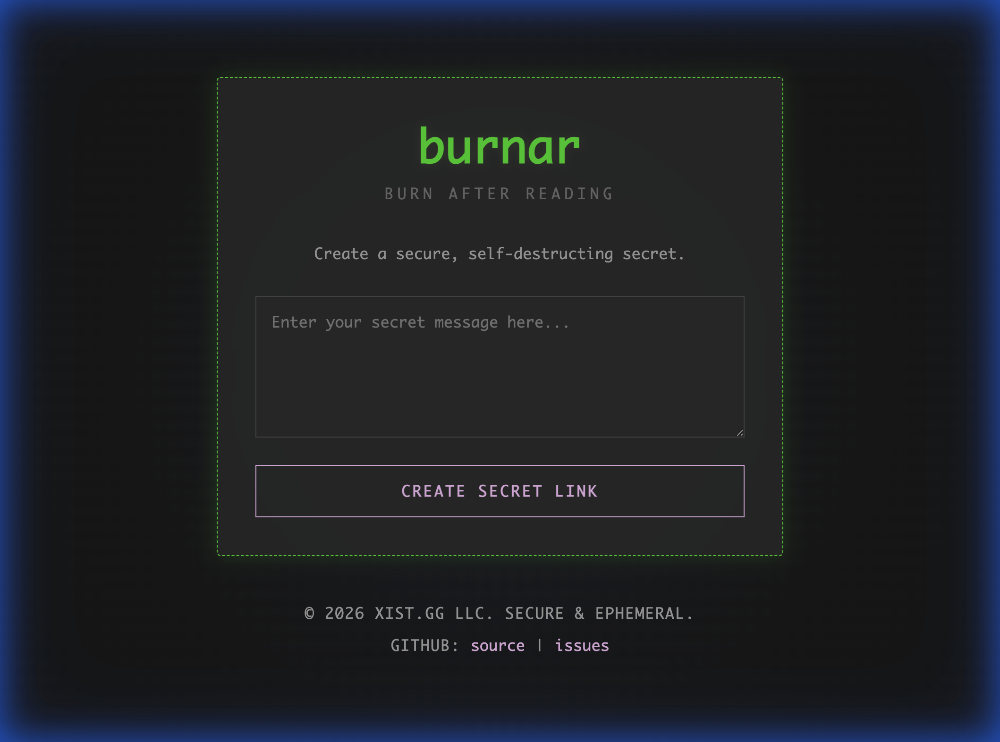

# Burnar

Burnar is a secure, ephemeral content sharing application ("Burn After Reading").

## Features

- **Ephemeral Storage**: Content is deleted immediately after viewing.
- **Encryption**: Content seems encrypted at rest.
- **No Database**: Uses file-based storage with locking mechanisms.
- **Dockerized**: Easy to run via Docker.

## Example Usage

### Alice shares a secret with Bob

1.  **Creation**: Alice needs to send a sensitive password to Bob. She opens her Burnar instance, types the password into the secure text box, and clicks **"Create Secret Link"**.
2.  **Sharing**: Burnar generates a unique, one-time URL. Alice copies this link and sends it to Bob via her preferred chat app.
3.  **Viewing**: Bob clicks the link. The secret is displayed on his screen.
4.  **Destruction**: Immediately after the secret is retrieved for Bob, it is permanently deleted from the server. If Bob refreshes the page or if anyone else clicks the link later, they will see a simplified page indicating the secret is gone.

[**Try the live demo at xist.gg/burnar/**](https://xist.gg/burnar/)

## Quick Start

### Development

1.  Ensure you have `uv` installed.
2.  Run `bin/dev-start.ps1`.
3.  Access at `http://localhost:8248`.

### Production

Burnar is designed to run behind an Nginx or Apache reverse proxy at a sub-path
(e.g. `https://site.com/burnar/`).  Launch uvicorn with `--root-path /burnar`
and point a `proxy_pass` / `ProxyPass` directive at `127.0.0.1:8248`.

See **[DEPLOYMENT.md](./DEPLOYMENT.md)** for full Nginx/Apache configuration,
systemd/Docker setup, and a security checklist.

> **Troubleshooting:** See [`TROUBLESHOOTING.md`](./TROUBLESHOOTING.md) if you encounter startup errors like "Permission denied".

## Limitations

Burnar uses local file locking ([portalocker](https://pypi.org/project/portalocker/))
to guard concurrent access to secrets on disk.  File locks are per-host and do
not synchronize across machines, so **burnar must run on a single server**.
Multi-server or load-balanced deployments would require replacing the storage
backend with a shared store (e.g. Redis, a database).

## License

MIT
